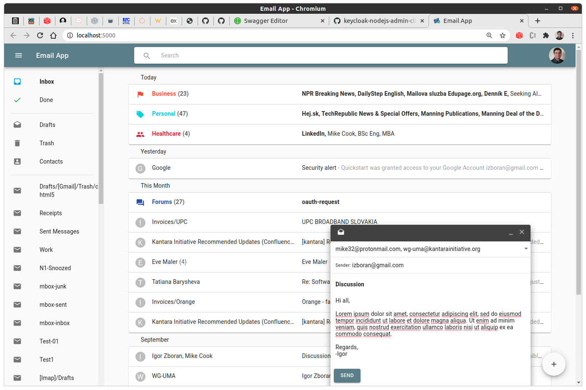

# UMA Email

A prototype implementation of the Authorization-Enhanced Mail System (AEMS) draft proposal, working as a proof of the concept of [UMA Correlated Authorization][1].

AEMS provides a mechanism to store, share and transfer information across security domains. From the user's point of view, AEMS looks like a standard email system.

## Screenshot

## Demo and Documentation

WIP, early stage [umabox.org][2].

## Acknowledgment

Credits go to [WG - User-Managed Access][3].

[1]: https://github.com/umalabs/uma-correlated-authorization
[2]: https://www.umabox.org
[3]: https://kantarainitiative.org/confluence/display/uma/Home

